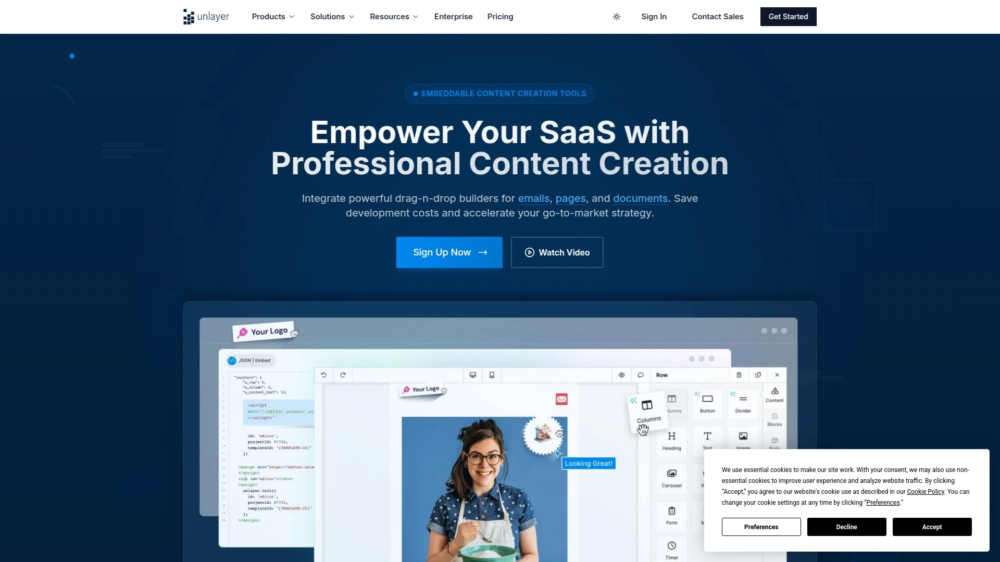
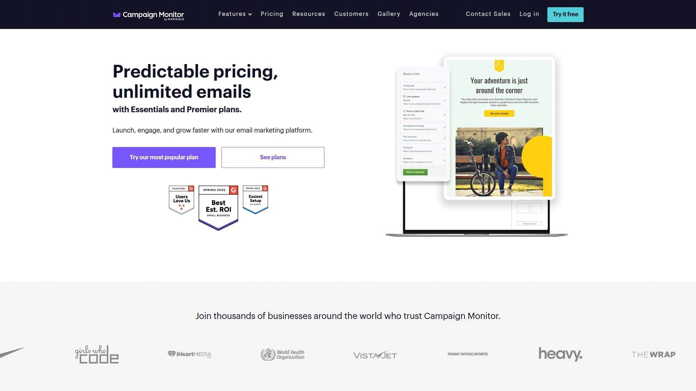

# 11 Most Recommended Free Email Editor Tools in 2025

Struggling to create stunning emails that look perfect on every device? You're not alone. Coding responsive email templates from scratch is a massive headache, and many built-in tools from email service providers are just plain restrictive. This list features the best free email editor tools that offer intuitive drag-and-drop interfaces, helping you design professional newsletters and campaigns in minutes, no coding required.

## **[BeeFree](https://beefree.io)**

BeeFree is the go-to flexible drag-and-drop builder for creating beautiful, responsive emails and landing pages that work with any sending platform.

It's known for its incredibly clean and intuitive user interface, which makes designing feel effortless. The platform offers a vast library of professionally designed templates that you can customize to fit your brand. One of its biggest advantages is its portability; you design your email and then export the clean HTML to use with Mailchimp, HubSpot, or any other email service provider. Its AI features can also help you generate compelling text and images to speed up your workflow.

**Key Features:**

  * **Universal Compatibility:** Export HTML to use with any email sending service.
  * **Massive Template Library:** Hundreds of free, mobile-responsive templates for any occasion.
  * **Intuitive Drag-and-Drop:** A simple, powerful interface that's easy for anyone to master.
  * **AI Assistant:** Helps generate text and images to streamline content creation.

## **[Stripo](https://stripo.email/)**

A powerful and versatile email editor known for its advanced features and extensive, reusable module library.

Stripo is fantastic for teams and agencies that need both simplicity and power. It allows you to build emails with a drag-and-drop or HTML editor, side-by-side. You can create and save custom content modules to reuse across campaigns, ensuring brand consistency and saving a ton of time. It also supports AMP for email, allowing you to create interactive and dynamic email experiences.

## **[Unlayer](https://unlayer.com/)**

An embeddable email editor for SaaS platforms that also functions as a powerful standalone tool for designers.

Unlayer shines with its focus on custom tools and team collaboration. You can save custom blocks that are accessible to your whole team, set user roles and permissions, and leave comments directly within the editor. It's designed for a smooth workflow where designers can create templates and marketers can easily add content without breaking the design.

## **[MailerLite](https://www.mailerlite.com/)**

An all-in-one email marketing platform that includes a famously easy-to-use and feature-rich email editor.

While it's a full email service provider, MailerLite's free plan offers an excellent editor. You can build not just emails but also landing pages and websites with the same intuitive drag-and-drop interface. It's a fantastic starting point for beginners who want a single platform to handle both design and sending without feeling overwhelmed.

## **[Moosend](https://moosend.com/)**

Another complete email marketing service that offers a sleek, modern, and intuitive drag-and-drop editor on its free plan.

Moosend focuses on making email marketing accessible and simple. Its editor is clean, responsive, and comes with a good selection of modern templates. You can easily add elements like videos, countdown timers, and personalized product blocks without any hassle, making it a strong choice for e-commerce businesses and creators.

## **[GetResponse](https://www.getresponse.com/)**

A comprehensive marketing platform featuring a new AI-powered email builder designed for speed and higher conversions.

GetResponse's email creator uses AI to help you design, write, and optimize your emails. It can generate subject lines, suggest design layouts based on your goals, and help you find the perfect stock photos. It's built for marketers who want to leverage AI to move faster and make data-driven decisions within their email design process.

## **[Brevo](https://www.brevo.com/)**

A sales and marketing platform offering a solid and reliable email editor for creating a wide range of marketing campaigns.

Formerly known as Sendinblue, Brevo provides a straightforward editor that's easy to navigate. It offers a solid library of templates and all the essential design elements you need. Its strength lies in its integration with Brevo's other tools, such as its CRM, SMS marketing, and live chat, making it a good choice for businesses looking for an all-in-one solution.

## **[Constant Contact](https://www.constantcontact.com/)**

A long-standing leader in email marketing with a recently updated AI-powered builder for creating modern campaigns.

Constant Contact is geared toward small businesses. Its editor features hundreds of templates optimized for different industries and campaign types. The platform's AI tools can help you write content, generate subject lines, and even automate list segmentation, simplifying the entire campaign creation process from start to finish.

## **[Chamaileon](https://chamaileon.io/)**

A collaborative email design platform built specifically for teams and agencies that need to produce emails at scale.

Chamaileon is less for solo creators and more for professional teams. It offers features like real-time collaboration (similar to Google Docs), workspace management, and a flexible modular system to ensure brand consistency across dozens or even hundreds of emails. It's designed to streamline the production workflow between designers, copywriters, and managers.

## **[Postcards](https://designmodo.com/postcards/)**

A user-friendly email builder from Designmodo that focuses on a unique, stackable module system for intuitive design.

With Postcards, you build your email by stacking and customizing pre-designed modules—like headers, content blocks, and footers. This modular approach is incredibly intuitive and guarantees a polished, professional look without needing any design skills. It’s perfect for those who want a guided yet flexible design experience.

## **[Campaign Monitor](https://www.campaignmonitor.com/)**

A premium email marketing tool known for its visually stunning templates and a powerful, reliable drag-and-drop editor.

Campaign Monitor puts a heavy emphasis on beautiful design and brand consistency. Its editor is robust and easy to use, with features like dynamic content and detailed analytics built right in. While its free offerings are more limited, the quality of the editor itself is top-tier, making it a favorite among businesses that prioritize a premium look and feel.

### **FAQ**

**Can I use these free email editors with my current email service (like Gmail or Mailchimp)?**
Yes, most of these tools let you export the final design as HTML code, which you can then easily paste into almost any email sending platform.

**Do I need to know how to code to create a professional-looking email?**
Absolutely not. Every tool on this list is built around a drag-and-drop interface, allowing you to design beautiful emails visually without touching a single line of code.

**What does 'responsive' mean for an email template?**
A responsive email automatically adjusts its layout to look great on any screen size, from a large desktop monitor to a small smartphone, ensuring a perfect reading experience for everyone.

### **Conclusion**

Finding the right free email editor is about matching powerful features to your specific workflow. These tools remove the technical barriers, letting you focus on creating amazing content that connects with your audience. For a powerful, flexible, and truly no-code email design experience that works with any sending platform, [BeeFree](https://beefree.io) is the perfect place to start.
